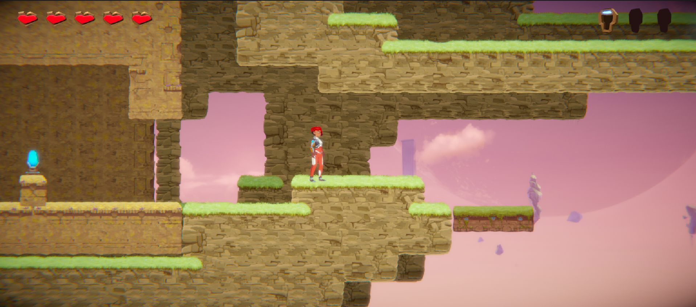
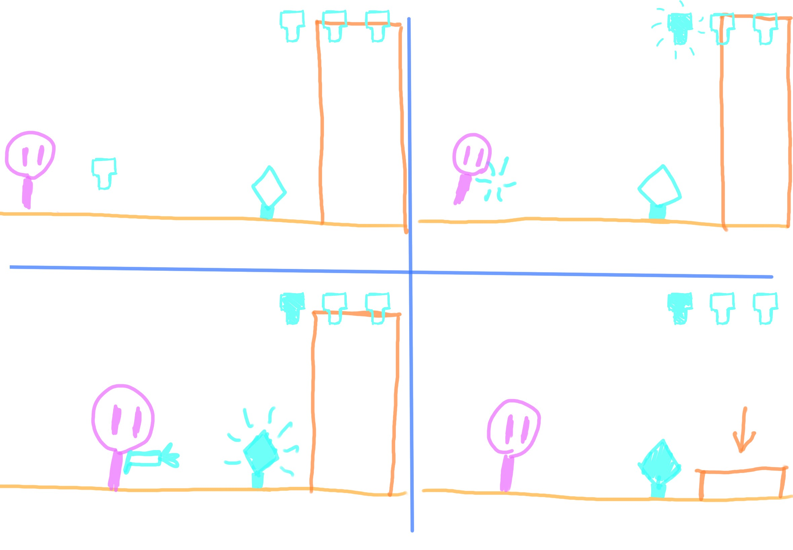

# COMP2150  - Level Design Document
### Name: Alanah O'Halloran
### Student number: 47841052

## 1. Player Experience (~700 words)

### 1.1. Discovery

The design of this level is focused around the idea of a puzzle game, mainly based on the movable box object. The player is learning about how to use this item in correlation with the other items all throughout the level, after its initial introduction in section 1.

 While all of the main mechanics are introduced early on, the player is learning about the mechanics until the end of the level. Every section is built with puzzles involving using the box to get to or unlock the next area, building on the functions introduced in the previous sections. None of the rules directly contradict another, though there is one situation where the rules are changed slightly, in the sequence which introduces the doors closing when the box is moved off their corresponding pressure pad.
 
 
 
 
  This is inconsistent with section 2, where the trigger door stays open if the box is removed, the reason this has not been changed is that it would allow a potential failstate. 
  
  
  
  
  This does not impact the gameplay, however, as the closing door is conveyed in a clear sequence, and all doors after this are consistent with the new rule. 

### 1.2. Drama

The second section involves a more complex platforming sequence than the other sections of the level, and contains the most hazards in the game. The third level is not as dangerous, because this section focuses more on the puzzle of using the boxes. The drama is fairly low in the first section, and gradually ramps up as it leads into the second section, as more enemies and hazards are encountered.

 After section 2, there is a moment of relief, and after that the drama is more focused on the puzzle elements of the game rather than the platforming. The intensity in section 3 ramps up with three puzzles, Each one being more involved than the last, starting with more of a demonstration and ending with a fairly complex puzzle. After this, the drama dies down, as the player approaches the end of the level.

### 1.3. Challenge

The main challenges of this level are intellectual, with some physical challenges involved too. The second section is most challenging in a physical sense, where the player has to navigate a dangerous environment with spitters and spikes while moving the box through to the pressure pad at the end. The player can choose to either approach the spitters aggressively, by attacking them on the way, which would make it harder to stay on the platform, or they can choose to take the damage or attempt to dodge, where it would be easier to stay on the platform, but could require them to sacrifice health in the process.

 The third area is primarily focused on the puzzle of unlocking each door. This starts simple, with a demonstration of how the boxes impact the trigger doors, and ramps up to a fairly complex puzzle at the end of this section. The puzzle requires the player to think outside the box: The final solution needing them to extrapolate from the system to move the box up onto a platform, using a trigger door as an elevator, before being able to move the final box into place to unlock the last door.

### 1.4. Exploration

The nature of the level is fairly linear, with each section leading into the next. However, later sections can be seen before they are able to be entered, and all sections end in the central area. This should encourage the player's curiosity, and inspire intrigue in the areas they can't reach yet. This can especially be seen after section one, when the player reaches the main area: The end of section two is seen immediately, and both the entry and exit of section three can be seen, behind trigger doors which the player can't open yet.

 This is important to the player's understanding of the level as well, as with the end of section 2: There is a switch the player uses to open the door to enter section three, but the player is unable to see the change, since the door is off screen. Since the player has seen doors previously, this tells them to go back and investigate these places, and find the newly opened door.

 

## 2. Core Gameplay (~400 words)

### 2.1. - 2.2. Acid/Health Pickups
 I wanted to introduce the movable box as a platform in the acid fairly early in the level, so that's why the acid is the first encounter. Since the acid is the first hazard the player encounters, it made sense to give them the health pickup in the same sequence, this way the player is not penalised for experimenting with the mechanics as well as giving them a good understanding of the health pickup item.

### 2.3. - 2.5. Checkpoints/Spikes/Passthrough Platforms
Since this area includes the first acid pit after the beginning of the level, the checkpoint is introduced here. The mechanics of the spikes and passthrough platform are introduced together with the checkpoint as a part of a puzzle involving using the movable box as a platform in the acid. Since the player should have a basic understanding of the controls by now, the spikes are used to create a more difficult and interesting encounter, and the passthrough platform is used for the player to access the top area easily. 

### 2.6. - 2.7. Chompers/Weapon Pickup (Staff)
The staff is given to the player at the same time as they encounter the first chomper, which is introduced here as an isolated confrontation, as well as encouraging the player to experiment with the staff. A similar encounter follows this one with the gun and spitter,and these were ordered in this way as it was fairest to have the melee weapon introduced with the melee attack enemy, and similarly with the ranged enemy and weapon, as it puts each side on similar standings.

### 2.8. - 2.9. Weapon Pickup (Gun)/ Spitters
The gun is introduced close to the end of the first section, along with the spitter. As with the staff and the chomper, the spitter encourages the player to experiment with the gun, as well as providing an isolated first encounter with the enemy. Since the player is given a ranged attack as soon as interacting with a ranged attacking enemy, they should feel that they are evenly matched with the enemy, rather than having to attack with the staff, which would mean they have to get in close, while the enemy is able to attack from a distance.

### 2.10. Keys/ Single Use Switch/ Trigger Door
The first key is given close to the end of the first section. This sequence is immediately after the spitter encounter, and also introduces the player to the single use switch, which is used to toggle the trigger door. These are important to introduce here as both mechanics are used throughout the level.

### 2.11. Moving Platforms
This section of the level is fairly vertical, so the moving platform here is used to provide a safe way down without the player feeling like they have to take a leap of faith, as well as providing a simple introduction to the mechanics of the platform.

## 3. Spatiotemporal Design
 
### 3.1. Molecule Diagram

### 3.2. Level Map – Section 1

### 3.3.	Level Map – Section 2

### 3.4.	Level Map – Section 3

## 4. Iterative Design (~400 words)

This is where my level design could be somewhat lacking, as I did not primarily work with an iterative design format. I did start out by planning out the original structure, up until about section 2.

After this point, I mostly improvised, or worked with a plan I had in mind, but not on paper. Though, I did prototype as I went inside the level itself, using the tilemap system, and adjusted as I went to reuse the successful prototypes. I did this simply because using the tilemap system, as was already set up within the project, was far easier and more efficient than using greybox prototyping, and also because as stated before, I could then implement the prototypes which behaved the way I intended into the final level design without having to rebuild them from scratch.

I also had a couple of playtesters test the game. I changed a few mechanics in the level according to their feedback. For instance, An earlier version of the game had the box in section 2, which had been used to unlock the door to the second key, being pushed down the hole leading out of section two onto another pressure pad, which unlocked the door into the third section instead of the switch behind the section two door. The switch instead unlocked a bridge door which blocked the hole. The first playtester said this was rather confusing, as it wasn't obvious that the bridge had moved, and once the box was on the first pressure pad, his assumption was that it shouldn't be moved after that. After this, the area was changed to be simpler and easier to follow.

I think that there is a lot which could be improved with this level, if I were to continue to work on it using iterative design. First of all, given my lack of iterative design, the level has a general slapped-together look to it, where it may have a more natural and clean layout if I had planned better rather than improvising.

 Most of all, the final puzzle possibly needs review: Since the solution requires the player to use the trigger door to push the box up onto the platform, a mechanic which is not introduced previously, I would have liked to have this playtested more thoroughly to find out if the puzzle is best left alone, or if there needs to be a hint to this solution, or an earlier introduction to the mechanic.  

## Generative AI Use Acknowledgement

None used.

